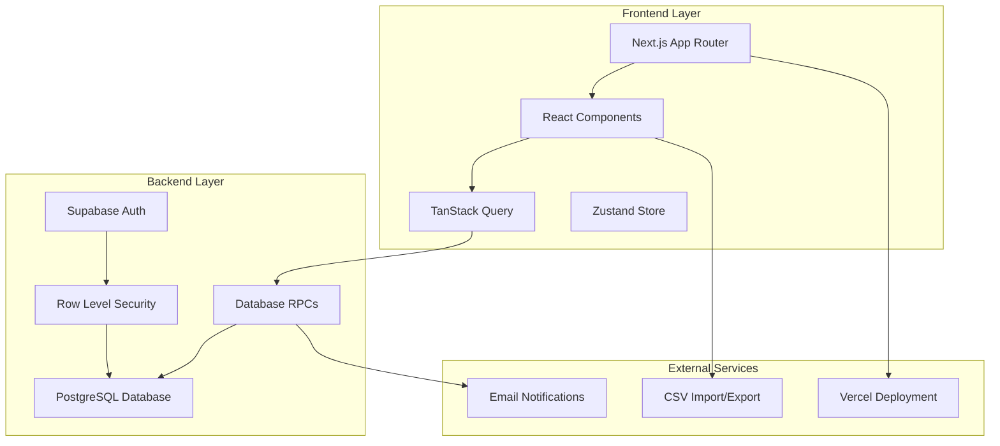
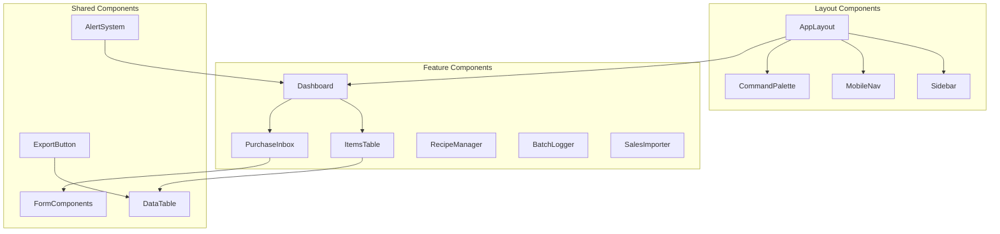
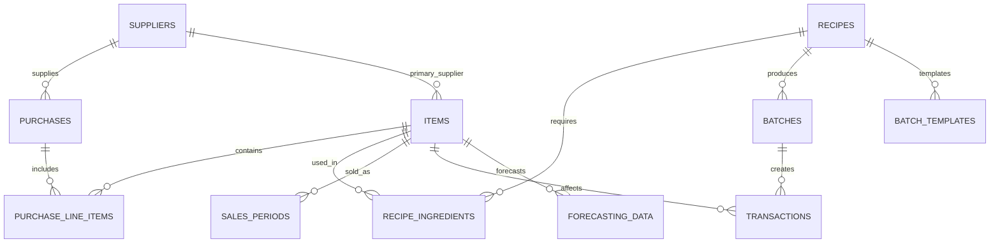

# Design Document

## Overview

This document outlines the technical design for a small business inventory management application that prioritizes flexibility, real-world workflows, and mobile-first user experience. The system supports the complete inventory lifecycle from procurement to sales with mutable transaction logs, intelligent forecasting, and proactive cycle count alerts.

The design emphasizes pragmatic solutions for small businesses with irregular workflows, allowing editable records, back-dating transactions, and providing intelligent alerts rather than rigid constraints. The architecture leverages modern web technologies with Supabase for backend services and Next.js for the frontend.

## Architecture

### System Architecture Overview



### Technology Stack

- **Frontend**: Next.js 14+ with App Router, React 18+, TypeScript
- **UI Library**: shadcn/ui components with Tailwind CSS
- **State Management**: TanStack Query for server state, URL params for view state, Zustand for global UI state
- **Backend**: Supabase (PostgreSQL + Auth + Real-time)
- **Database**: PostgreSQL with custom RPCs for business logic
- **Deployment**: Vercel for frontend, Supabase for backend services
- **Data Tables**: TanStack Table for performant, customizable grids

### Design Patterns

- **Display ID Pattern**: User-facing identifiers (SKU, displayId) separate from database UUIDs
- **Mutable Transaction Logs**: Editable records with audit trails for flexibility
- **On-Demand Calculations**: WAC and forecasting computed when needed with caching
- **Mobile-First Responsive**: Touch-friendly interfaces with desktop optimization
- **Direct Edit Workflows**: In-place editing for quick updates

## Components and Interfaces

### Core Components Architecture



### Component Specifications

#### Dashboard Component
- **Purpose**: 30-second business health check with Action Center
- **Features**: 
  - Top 5 cycle count alerts using priority algorithm
  - Basic margin calculator (revenue - COGS)
  - Export buttons for data and recent changes
  - Mobile-optimized touch targets (≥44px)
- **Data Sources**: Items, sales_periods, transactions tables
- **State Management**: TanStack Query for real-time data

#### ItemsTable Component
- **Purpose**: Manage inventory items with direct editing
- **Features**:
  - Search/filter by SKU, name, type
  - Direct-edit quantity with +/- buttons
  - Quick Reorder buttons for low-stock items
  - Auto/Manual badges for reorder points
  - Cycle count alert sorting mode
- **Interactions**: Inline editing, modal details, quick actions
- **Mobile Optimization**: Expandable rows, swipe actions

#### PurchaseInbox Component
- **Purpose**: Streamlined purchase logging with bank CSV import
- **Features**:
  - Master-detail layout (desktop) / single-column (mobile)
  - Smart CSV import with supplier matching
  - Draft purchase review workflow
  - Proportional cost allocation with non-inventory exclusion
- **Data Flow**: CSV → supplier matching → draft creation → line item completion

#### RecipeManager Component
- **Purpose**: Define recipes with scaling and batch templates
- **Features**:
  - Recipe CRUD with ingredient management
  - Recipe scaling with proportional calculations
  - Batch template creation and reuse
  - Max batches calculation based on inventory
- **Business Logic**: Version increment on edits, yield calculations

#### BatchLogger Component
- **Purpose**: Log production batches with yield analysis
- **Features**:
  - Recipe-based batch creation
  - Ingredient consumption with negative inventory warnings
  - Yield percentage and cost variance calculations
  - Template-based batch configurations
- **Validation**: Stock sufficiency checks with proceed-on-negative logic

### Interface Definitions

#### Core Data Interfaces

```typescript
interface Item {
  itemId: string;
  name: string;
  SKU: string;
  type: 'ingredient' | 'packaging' | 'product';
  inventoryUnit: InventoryUnit;
  currentQuantity: number;
  weightedAverageCost: number;
  reorderPoint?: number;
  lastCountedDate?: Date;
  primarySupplierId?: string;
  leadTimeDays: number;
  isArchived: boolean;
}

interface Purchase {
  purchaseId: string;
  displayId: string;
  supplierId: string;
  purchaseDate: Date;
  effectiveDate: Date;
  grandTotal: number;
  shipping: number;
  taxes: number;
  otherCosts: number;
  notes?: string;
  isDraft: boolean;
  lineItems: PurchaseLineItem[];
}

interface Recipe {
  recipeId: string;
  name: string;
  version: number;
  displayVersion: string;
  outputProductId: string;
  expectedYield: number;
  laborMinutes?: number;
  projectedMaterialCost?: number;
  ingredients: RecipeIngredient[];
}

interface Batch {
  batchId: string;
  displayId: string;
  recipeId: string;
  dateCreated: Date;
  effectiveDate: Date;
  qtyMade: number;
  yieldPercentage?: number;
  materialCost: number;
  laborCost: number;
  actualCost: number;
  costVariance?: number;
  expiryDate?: Date;
  notes?: string;
}
```

#### Business Logic Interfaces

```typescript
interface CycleCountAlert {
  itemId: string;
  SKU: string;
  name: string;
  currentQuantity: number;
  reorderPoint?: number;
  priorityScore: number;
  alertType: 'NEGATIVE_INVENTORY' | 'LOW_STOCK';
  shortageAmount?: number;
}

interface ForecastingData {
  forecastingId: string;
  itemId: string;
  predictedDemand: number;
  seasonalIndex: number;
  recommendedReorderPoint: number;
  isAutomatic: boolean;
  calculatedAt: Date;
}

interface BatchTemplate {
  templateId: string;
  name: string;
  recipeId: string;
  scaleFactor: number;
  notes?: string;
  created_at: Date;
}

interface QuickReorderRequest {
  itemId: string;
  supplierId: string;
  quantity: number;
  estimatedCost: number;
}
```

## Data Models

### Complete Database Schema

#### Core Tables

```sql
-- Items table with inventory tracking
CREATE TABLE items (
  itemId UUID PRIMARY KEY DEFAULT gen_random_uuid(),
  name TEXT NOT NULL,
  SKU TEXT UNIQUE NOT NULL,
  type item_type NOT NULL,
  isArchived BOOLEAN DEFAULT FALSE,
  inventoryUnit inventory_unit NOT NULL,
  currentQuantity NUMERIC DEFAULT 0,
  weightedAverageCost NUMERIC DEFAULT 0,
  reorderPoint NUMERIC,
  lastCountedDate DATE,
  primarySupplierId UUID REFERENCES suppliers(supplierId),
  leadTimeDays INTEGER DEFAULT 7,
  created_at TIMESTAMPTZ DEFAULT NOW(),
  updated_at TIMESTAMPTZ
);

-- Suppliers for purchase management
CREATE TABLE suppliers (
  supplierId UUID PRIMARY KEY DEFAULT gen_random_uuid(),
  name TEXT NOT NULL,
  contactEmail TEXT,
  contactPhone TEXT,
  address TEXT,
  notes TEXT,
  isArchived BOOLEAN DEFAULT FALSE,
  created_at TIMESTAMPTZ DEFAULT NOW()
);

-- Purchases with draft support
CREATE TABLE purchases (
  purchaseId UUID PRIMARY KEY DEFAULT gen_random_uuid(),
  displayId TEXT UNIQUE NOT NULL,
  supplierId UUID REFERENCES suppliers(supplierId) NOT NULL,
  purchaseDate DATE NOT NULL,
  effectiveDate DATE NOT NULL,
  grandTotal NUMERIC NOT NULL,
  shipping NUMERIC DEFAULT 0,
  taxes NUMERIC DEFAULT 0,
  otherCosts NUMERIC DEFAULT 0,
  notes TEXT,
  isDraft BOOLEAN DEFAULT TRUE,
  created_at TIMESTAMPTZ DEFAULT NOW(),
  updated_at TIMESTAMPTZ
);

-- Purchase line items for cost allocation
CREATE TABLE purchase_line_items (
  lineItemId UUID PRIMARY KEY DEFAULT gen_random_uuid(),
  purchaseId UUID REFERENCES purchases(purchaseId) NOT NULL,
  itemId UUID REFERENCES items(itemId) NOT NULL,
  quantity NUMERIC NOT NULL,
  unitCost NUMERIC NOT NULL,
  totalCost NUMERIC NOT NULL,
  notes TEXT
);

-- Recipes for production management
CREATE TABLE recipes (
  recipeId UUID PRIMARY KEY DEFAULT gen_random_uuid(),
  name TEXT NOT NULL,
  version INTEGER DEFAULT 1,
  displayVersion TEXT NOT NULL,
  outputProductId UUID REFERENCES items(itemId) NOT NULL,
  expectedYield NUMERIC NOT NULL,
  laborMinutes INTEGER,
  projectedMaterialCost NUMERIC,
  isArchived BOOLEAN DEFAULT FALSE,
  created_at TIMESTAMPTZ DEFAULT NOW(),
  updated_at TIMESTAMPTZ
);

-- Recipe ingredients for batch calculations
CREATE TABLE recipe_ingredients (
  ingredientId UUID PRIMARY KEY DEFAULT gen_random_uuid(),
  recipeId UUID REFERENCES recipes(recipeId) NOT NULL,
  itemId UUID REFERENCES items(itemId) NOT NULL,
  quantity NUMERIC NOT NULL,
  notes TEXT
);

-- Production batches with yield tracking
CREATE TABLE batches (
  batchId UUID PRIMARY KEY DEFAULT gen_random_uuid(),
  displayId TEXT UNIQUE NOT NULL,
  recipeId UUID REFERENCES recipes(recipeId) NOT NULL,
  dateCreated DATE NOT NULL,
  effectiveDate DATE NOT NULL,
  qtyMade NUMERIC NOT NULL,
  yieldPercentage NUMERIC,
  materialCost NUMERIC NOT NULL,
  laborCost NUMERIC DEFAULT 0,
  actualCost NUMERIC NOT NULL,
  costVariance NUMERIC,
  expiryDate DATE,
  notes TEXT,
  created_at TIMESTAMPTZ DEFAULT NOW()
);

-- Sales periods for forecasting
CREATE TABLE sales_periods (
  salesPeriodId UUID PRIMARY KEY DEFAULT gen_random_uuid(),
  itemId UUID REFERENCES items(itemId) NOT NULL,
  periodStart DATE NOT NULL,
  periodEnd DATE NOT NULL,
  quantitySold NUMERIC NOT NULL,
  revenue NUMERIC NOT NULL,
  created_at TIMESTAMPTZ DEFAULT NOW()
);

-- Transaction log for audit trail
CREATE TABLE transactions (
  transactionId UUID PRIMARY KEY DEFAULT gen_random_uuid(),
  itemId UUID REFERENCES items(itemId) NOT NULL,
  transactionType transaction_type NOT NULL,
  quantity NUMERIC NOT NULL,
  unitCost NUMERIC,
  referenceId UUID,
  referenceType TEXT,
  effectiveDate DATE NOT NULL,
  notes TEXT,
  created_at TIMESTAMPTZ DEFAULT NOW()
);

-- Forecasting data for automatic reorder points
CREATE TABLE forecasting_data (
  forecastingId UUID PRIMARY KEY DEFAULT gen_random_uuid(),
  itemId UUID REFERENCES items(itemId) NOT NULL,
  predictedDemand NUMERIC NOT NULL,
  seasonalIndex NUMERIC DEFAULT 1.0,
  recommendedReorderPoint NUMERIC,
  isAutomatic BOOLEAN DEFAULT TRUE,
  calculatedAt TIMESTAMPTZ DEFAULT NOW(),
  UNIQUE(itemId)
);

-- Batch templates for reusable configurations
CREATE TABLE batch_templates (
  templateId UUID PRIMARY KEY DEFAULT gen_random_uuid(),
  name TEXT NOT NULL,
  recipeId UUID REFERENCES recipes(recipeId) NOT NULL,
  scaleFactor NUMERIC DEFAULT 1.0,
  notes TEXT,
  created_at TIMESTAMPTZ DEFAULT NOW()
);
```

#### Enums and Types

```sql
CREATE TYPE item_type AS ENUM ('ingredient', 'packaging', 'product');
CREATE TYPE inventory_unit AS ENUM ('each', 'lb', 'oz', 'kg', 'g', 'gal', 'qt', 'pt', 'cup', 'fl_oz', 'ml', 'l');
CREATE TYPE transaction_type AS ENUM ('purchase', 'sale', 'adjustment', 'batch_consumption', 'batch_production');
```

### Data Relationships



### Business Logic Implementation

#### Core Business Functions

The following SQL functions implement the core business logic for inventory management. All functions are designed to handle edge cases gracefully and support the flexible workflows required by small businesses.

#### Weighted Average Cost Calculation
```sql
CREATE OR REPLACE FUNCTION calculate_wac(item_id UUID)
RETURNS NUMERIC AS $$
DECLARE
  result NUMERIC;
BEGIN
  SELECT 
    SUM(quantity * unitCost) / SUM(quantity)
  INTO result
  FROM purchase_line_items pli
  JOIN purchases p ON pli.purchaseId = p.purchaseId
  WHERE pli.itemId = item_id
    AND p.isDraft = false;
    
  IF result IS NULL THEN
    RAISE WARNING 'NO_HISTORY: No purchase history found for item %', item_id;
    RETURN 0;
  END IF;
  
  RETURN result;
END;
$$ LANGUAGE plpgsql;
```

#### Cycle Count Alert Algorithm
```sql
CREATE OR REPLACE FUNCTION get_cycle_count_alerts(limit_count INTEGER DEFAULT 5)
RETURNS TABLE(
  itemId UUID,
  SKU TEXT,
  name TEXT,
  currentQuantity NUMERIC,
  reorderPoint NUMERIC,
  priorityScore NUMERIC,
  alertType TEXT
) AS $$
BEGIN
  RETURN QUERY
  SELECT 
    i.itemId,
    i.SKU,
    i.name,
    i.currentQuantity,
    i.reorderPoint,
    ((CURRENT_DATE - COALESCE(i.lastCountedDate, CURRENT_DATE - INTERVAL '365 days')) / 30.0) + 
    (1 - i.currentQuantity / GREATEST(COALESCE(i.reorderPoint, 1), 1)) as priorityScore,
    CASE 
      WHEN i.currentQuantity < 0 THEN 'NEGATIVE_INVENTORY'
      WHEN i.currentQuantity <= COALESCE(i.reorderPoint, 0) THEN 'LOW_STOCK'
    END as alertType
  FROM items i
  WHERE i.isArchived = false
  ORDER BY priorityScore DESC
  LIMIT limit_count;
END;
$$ LANGUAGE plpgsql;
```

#### Inventory Forecasting Logic
```sql
CREATE OR REPLACE FUNCTION calculate_forecasting(item_id UUID)
RETURNS VOID AS $$
DECLARE
  avg_monthly_sales NUMERIC;
  seasonal_index NUMERIC;
  lead_time_days INTEGER;
  recommended_reorder NUMERIC;
BEGIN
  -- Calculate 3-month moving average
  SELECT 
    AVG(quantitySold) / 30.0, -- Daily average
    COALESCE(i.leadTimeDays, 7)
  INTO avg_monthly_sales, lead_time_days
  FROM sales_periods sp
  JOIN items i ON sp.itemId = i.itemId
  WHERE sp.itemId = item_id
    AND sp.periodEnd >= CURRENT_DATE - INTERVAL '3 months';
  
  -- Simple seasonality: compare current month to average
  SELECT 
    COALESCE(
      (SELECT AVG(quantitySold) FROM sales_periods 
       WHERE itemId = item_id 
         AND EXTRACT(MONTH FROM periodStart) = EXTRACT(MONTH FROM CURRENT_DATE)
         AND periodEnd >= CURRENT_DATE - INTERVAL '12 months') / 
      NULLIF(avg_monthly_sales * 30, 0), 
      1.0
    )
  INTO seasonal_index;
  
  -- Calculate recommended reorder point
  recommended_reorder := (avg_monthly_sales * lead_time_days * seasonal_index) * 1.2; -- 20% buffer
  
  -- Upsert forecasting data for trending
  INSERT INTO forecasting_data (itemId, predictedDemand, seasonalIndex, recommendedReorderPoint, isAutomatic, calculatedAt)
  VALUES (item_id, avg_monthly_sales * 30, seasonal_index, recommended_reorder, TRUE, NOW())
  ON CONFLICT (itemId) 
  DO UPDATE SET 
    predictedDemand = EXCLUDED.predictedDemand,
    seasonalIndex = EXCLUDED.seasonalIndex,
    recommendedReorderPoint = EXCLUDED.recommendedReorderPoint,
    calculatedAt = EXCLUDED.calculatedAt;
  
  -- Only update item's reorder point if in automatic mode
  UPDATE items 
  SET reorderPoint = recommended_reorder
  WHERE itemId = item_id
    AND EXISTS (
      SELECT 1 FROM forecasting_data 
      WHERE itemId = item_id AND isAutomatic = TRUE
    );
END;
$$ LANGUAGE plpgsql;
```

## Error Handling

### Standardized Error Types

The system implements consistent error handling across all components:

#### Client-Side Error Handling
```typescript
enum ErrorType {
  NEGATIVE_INVENTORY_WARNING = 'NEGATIVE_INVENTORY_WARNING',
  INSUFFICIENT_STOCK = 'INSUFFICIENT_STOCK',
  DUPLICATE_DISPLAY_ID = 'DUPLICATE_DISPLAY_ID',
  ARCHIVED_REFERENCE = 'ARCHIVED_REFERENCE',
  INVALID_ALLOCATION = 'INVALID_ALLOCATION',
  NO_PURCHASE_HISTORY = 'NO_PURCHASE_HISTORY'
}

interface BusinessError {
  type: ErrorType;
  message: string;
  details?: Record<string, any>;
  canProceed: boolean;
}
```

#### Error Handling Patterns
- **Negative Inventory**: Show warnings but allow transactions to proceed (all database functions allow negatives with NEGATIVE_INVENTORY_WARNING but proceed, supporting small-business flexibility). All errors support forgiving workflows—system warns but doesn't block irregular operations like logging sales before stock arrives.
- **Validation Errors**: Inline feedback with clear resolution steps
- **Import Errors**: Detailed validation with correction suggestions
- **Network Errors**: Retry mechanisms with user feedback
- **Data Conflicts**: Clear conflict resolution options

### Alert System Design

The system provides customizable notification rules with multiple delivery methods. Implementation uses Supabase Edge Functions for email delivery and real-time subscriptions for in-app notifications.

```typescript
interface AlertConfig {
  type: 'NEGATIVE_INVENTORY' | 'LOW_STOCK' | 'CYCLE_COUNT' | 'BATCH_COMPLETE';
  threshold?: number;
  enabled: boolean;
  deliveryMethods: ('email' | 'in_app')[];
  recipients?: string[];
}

interface NotificationRule {
  id: string;
  name: string;
  condition: string; // SQL-like condition
  alertConfig: AlertConfig;
  isActive: boolean;
}

interface AlertTrigger {
  ruleId: string;
  triggeredAt: Date;
  data: Record<string, any>;
  delivered: boolean;
  deliveryAttempts: number;
}
```

## Testing Strategy

### Testing Approach

#### Unit Testing
- **Business Logic**: WAC calculations, forecasting algorithms, cycle count scoring
- **Utility Functions**: Display ID generation, date formatting, validation helpers
- **Data Transformations**: CSV parsing, export formatting, API response mapping

#### Integration Testing
- **Database RPCs**: Purchase logging, batch creation, inventory adjustments
- **API Endpoints**: CRUD operations, bulk imports, data exports
- **Authentication**: User permissions, row-level security

#### End-to-End Testing
- **Core Workflows**: Purchase → inventory update → WAC recalculation
- **Production Flow**: Recipe → batch → ingredient consumption → product creation
- **Mobile Experience**: Touch interactions, responsive layouts, offline behavior

#### Performance Testing
- **Large Datasets**: 10,000+ items, 100,000+ transactions
- **Concurrent Users**: Multiple users editing simultaneously
- **Mobile Performance**: Load times, touch responsiveness

### Test Data Strategy

Use factories like createTestItem and createTestPurchase for consistent test data. AI builders can expand these into full Vitest suites, simulating scenarios like negative inventory (expected: warning shown, transaction proceeds) and edge cases such as WAC calculation with no purchase history (expected: default to 0 with warning).

---

This design document provides a comprehensive technical foundation for implementing the inventory management system. The architecture emphasizes flexibility, performance, and user experience while maintaining data integrity and business logic consistency. The modular component design enables incremental development and testing, supporting the spec-driven development approach outlined in the requirements.
